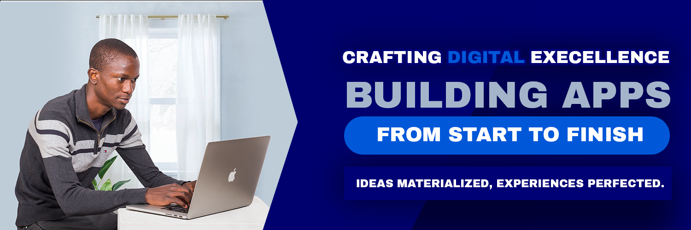

### Hi there 👋, I'm Gift Masekere

I'm a passionate MERN stack developer with 4 of experience in building web applications. 
I love to solve problems and create efficient, scalable solutions. Here's a bit about me:

- 🔭 I’m currently working on 
- 🌱 I’m currently learning on the SDLC life cycle 
- 💬 Ask me about anything related to MERN stack development
- 📫 How to reach me: masekeregift@gmail.com

## Connect with me

## Skills

- Frontend: HTML, CSS, JavaScript, Typescript, React.js
- Backend: Node.js, Express.js
- Database: MongoDB
- Other: Git, RESTful APIs, Heroku, shell programming
<!--
**masekere/masekere** is a ✨ _special_ ✨ repository because its `README.md` (this file) appears on your GitHub profile.

Here are some ideas to get you started:

- 🔭 I’m currently working on ...
- 🌱 I’m currently learning ...
- 👯 I’m looking to collaborate on ...
- 🤔 I’m looking for help with ...
- 💬 Ask me about ...
- 📫 How to reach me: ...
- 😄 Pronouns: ...
- ⚡ Fun fact: ...
-->
